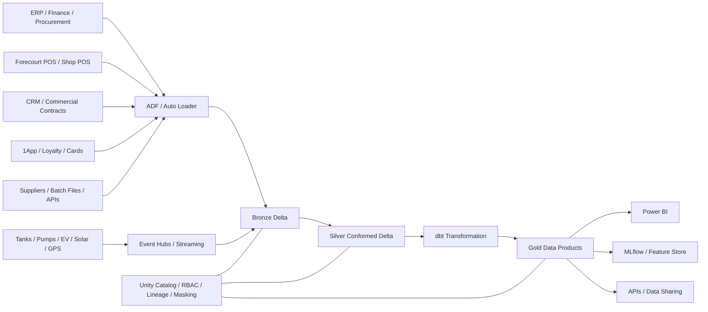

# Vivo Energy 360 — Synthetic End-to-End Data Engineering Platform

> **Independent portfolio / educational project only.**
> Not affiliated with, sponsored by, or endorsed by Vivo Energy, Engen, Shell, Vitol, or any related company.
> No internal or confidential company data is used.

## Project purpose

A production-style downstream-energy data platform modelling the complete operating chain:

**Supply & Procurement → Storage → Distribution → Retail → Commercial/B2B → Aviation → Marine → LPG → Lubricants → Convenience Retail → Loyalty & Digital → EV/Solar → Asset Maintenance → HSSEQ → Finance → Executive BI**

The project is deliberately structured for an **Azure Databricks + Delta Lake + dbt + Power BI** portfolio.

## Public scale anchor

Current public Vivo Energy information describes approximately:

- **4,200 service stations**
- **29 markets**
- **21 billion litres of fuel sold per year**
- **2+ billion litres of storage**
- **2 million customers served daily**

The synthetic model uses these figures only to create a realistic *order of magnitude*.

## South Africa

The `portfolio` generator creates approximately **1,050 synthetic South African service stations**, distributed across all nine provinces and clustered around major cities/towns.

The exact station names and coordinates are **fictional**. Coordinates are jittered around city centres.

The project also includes a **legacy public terminal/depot seed list** for modelling logistics nodes. Do not treat it as a statement of current operating status.

## Architecture



## Portfolio-scale dummy data

Run:

```bash
python src/generate_synthetic_data.py --output data/portfolio --scale portfolio --format parquet --seed 42
```

`portfolio` generates **well over 15 million fact records**.

Suggested row volumes:

| Domain | Portfolio rows |
|---|---:|
| Retail fuel transactions | 5,000,000 |
| Convenience shop lines | 3,000,000 |
| Loyalty transactions | 2,000,000 |
| Digital/app events | 1,500,000 |
| Inventory snapshots | 1,200,000 |
| Commercial orders | 550,000 |
| LPG sales | 400,000 |
| Lubricant sales | 350,000 |
| Deliveries | 300,000 |
| Procurement receipts | 250,000 |
| Solar telemetry | 650,000 |
| EV charging sessions | 150,000 |
| Aviation sales | 120,000 |
| Marine sales | 90,000 |
| Maintenance work orders | 80,000 |
| HSSEQ incidents | 15,000 |
| **Total facts** | **15,655,000** |

The `enterprise` profile is designed for Databricks and scales to roughly **100M+ fact records**.

## Main dimensions

- `dim_date`
- `dim_country`
- `dim_region`
- `dim_site`
- `dim_terminal`
- `dim_product`
- `dim_customer`
- `dim_supplier`
- `dim_vehicle`
- `dim_employee`
- `dim_asset`
- `dim_contract`
- `dim_promotion`
- `dim_channel`

## Main facts

- `fact_retail_fuel_sales`
- `fact_shop_sales`
- `fact_commercial_orders`
- `fact_inventory_snapshot`
- `fact_deliveries`
- `fact_procurement_receipts`
- `fact_aviation_sales`
- `fact_marine_sales`
- `fact_lpg_sales`
- `fact_lubricant_sales`
- `fact_loyalty_transactions`
- `fact_digital_events`
- `fact_ev_charging_sessions`
- `fact_solar_generation`
- `fact_maintenance_work_orders`
- `fact_hsseq_incidents`

## Medallion design

### Bronze
Append-only, source-aligned tables with:
- ingestion timestamp
- source filename/topic
- batch ID
- record hash
- schema version

### Silver
- type casting
- de-duplication
- business-key validation
- referential integrity
- currency normalisation
- litres / kg standardisation
- SCD2 master data
- PII tokenisation
- data-quality quarantine
- late-arriving event handling

### Gold
Domain-oriented dimensional marts:
- Core
- Retail
- Commercial
- Supply & Logistics
- Operations / HSSEQ
- New Energy
- Executive 360

## Strong portfolio use cases

### Data Engineering
- Auto Loader ingestion
- Delta Lake MERGE
- change data capture
- schema evolution
- structured streaming
- partitioning / clustering
- orchestration
- data-quality gates
- observability
- CI/CD
- Unity Catalog security

### Analytics Engineering
- dbt staging → intermediate → marts
- tests
- snapshots / SCD2
- metrics definitions
- lineage
- documentation
- semantic-model-ready stars

### ML / Advanced Analytics
- station demand forecasting
- terminal replenishment
- stock-out prediction
- late-delivery risk
- transaction anomaly/fraud detection
- commercial churn
- CLV
- site segmentation
- predictive maintenance
- incident-risk scoring
- EV utilisation forecasting
- solar generation forecasting

## Suggested Power BI pages

1. Executive 360
2. Retail Network
3. Site Performance
4. Convenience Retail
5. Commercial & B2B
6. Supply / Storage
7. Distribution / OTIF
8. Aviation & Marine
9. LPG & Lubricants
10. Loyalty / Digital
11. EV & Solar
12. Maintenance
13. HSSEQ
14. Finance & Margin
15. South Africa Geospatial Network

See `powerbi/dax_measures.md` and `docs/kpi_catalogue.md`.

## Repository

```text
.
├── README.md
├── dbt_project.yml
├── profiles.example.yml
├── requirements.txt
├── src/
│   └── generate_synthetic_data.py
├── sql/
│   ├── 00_catalogues.sql
│   ├── 01_bronze_tables.sql
│   ├── 02_silver_tables.sql
│   └── 03_gold_star_schema.sql
├── notebooks/
│   ├── 01_bronze_ingestion.py
│   ├── 02_silver_conformance.py
│   └── 03_gold_build.py
├── models/
│   ├── staging/
│   ├── intermediate/
│   └── marts/
├── docs/
│   ├── architecture.mmd
│   ├── erd_full.mmd
│   ├── erd_full.png
│   ├── erd_full.svg
│   ├── bus_matrix.md
│   ├── data_dictionary.md
│   ├── kpi_catalogue.md
│   ├── orchestration.md
│   ├── security_governance.md
│   └── portfolio_case_study.md
├── powerbi/
│   └── dax_measures.md
├── seeds/
│   ├── sa_location_seed.csv
│   └── sa_terminal_legacy_seed.csv
├── tests/
│   └── test_data_quality.py
└── sample_data/
```

## Portfolio wording

Recommended:

> I designed an independent synthetic downstream-energy platform inspired by the public operating model of a pan-African energy distributor. The solution models more than 15 million transactions across retail fuel, convenience, B2B, supply, storage, logistics, LPG, lubricants, aviation, marine, loyalty, digital, EV/solar, maintenance and HSSEQ. I implemented a Databricks medallion architecture with Delta Lake, dbt, Unity Catalog, CI/CD, data-quality controls and Power BI-ready dimensional marts.

Avoid suggesting that the data came from Vivo Energy or Engen.
