# ERD — Assets and maintenance

> **Independent synthetic portfolio project.** No internal Vivo Energy, Engen, Shell or Vitol data.

Generated from the build manifest by `scripts/generate_erd.py`.

```mermaid
erDiagram
    DIM_DATE ||--o{ FACT_ASSET_DOWNTIME : ""
    DIM_ASSET ||--o{ FACT_ASSET_DOWNTIME : ""
    DIM_SITE ||--o{ FACT_ASSET_DOWNTIME : ""
    DIM_DATA_SOURCE ||--o{ FACT_ASSET_DOWNTIME : ""
    DIM_DATE ||--o{ FACT_ASSET_FAILURES : ""
    DIM_ASSET ||--o{ FACT_ASSET_FAILURES : ""
    DIM_SITE ||--o{ FACT_ASSET_FAILURES : ""
    DIM_DATA_SOURCE ||--o{ FACT_ASSET_FAILURES : ""
    DIM_DATE ||--o{ FACT_ASSET_INSPECTIONS : ""
    DIM_ASSET ||--o{ FACT_ASSET_INSPECTIONS : ""
    DIM_SITE ||--o{ FACT_ASSET_INSPECTIONS : ""
    DIM_DATA_SOURCE ||--o{ FACT_ASSET_INSPECTIONS : ""
    DIM_DATE ||--o{ FACT_ASSET_METER_READINGS : ""
    DIM_ASSET ||--o{ FACT_ASSET_METER_READINGS : ""
    DIM_SITE ||--o{ FACT_ASSET_METER_READINGS : ""
    DIM_DATA_SOURCE ||--o{ FACT_ASSET_METER_READINGS : ""
    DIM_DATE ||--o{ FACT_MAINTENANCE_WORK_ORDERS : ""
    DIM_ASSET ||--o{ FACT_MAINTENANCE_WORK_ORDERS : ""
    DIM_SITE ||--o{ FACT_MAINTENANCE_WORK_ORDERS : ""
    DIM_DATA_SOURCE ||--o{ FACT_MAINTENANCE_WORK_ORDERS : ""
    DIM_DATE ||--o{ FACT_SPARE_PARTS_USAGE : ""
    DIM_ASSET ||--o{ FACT_SPARE_PARTS_USAGE : ""
    DIM_WAREHOUSE ||--o{ FACT_SPARE_PARTS_USAGE : ""
    DIM_DATA_SOURCE ||--o{ FACT_SPARE_PARTS_USAGE : ""
    FACT_ASSET_DOWNTIME {
        string date_key FK
        string asset_id FK
        string site_id FK
        string source_system_code FK
        decimal downtime_hours
        decimal lost_volume_litres
        decimal lost_revenue_zar
    }
    FACT_ASSET_FAILURES {
        string date_key FK
        string asset_id FK
        string site_id FK
        string source_system_code FK
        decimal asset_age_years
        decimal time_to_repair_hours
        decimal repair_cost_zar
    }
    FACT_ASSET_INSPECTIONS {
        string date_key FK
        string asset_id FK
        string site_id FK
        string source_system_code FK
        decimal condition_score
    }
    FACT_ASSET_METER_READINGS {
        string date_key FK
        string asset_id FK
        string site_id FK
        string source_system_code FK
        decimal running_hours
        decimal vibration_mm_s
        decimal temperature_celsius
        decimal pressure_bar
        decimal current_draw_amps
    }
    FACT_MAINTENANCE_WORK_ORDERS {
        string date_key FK
        string asset_id FK
        string site_id FK
        string source_system_code FK
        decimal asset_age_years
        decimal response_hours
        decimal labour_hours
        decimal labour_cost_zar
        decimal parts_cost_zar
        decimal total_cost_zar
    }
    FACT_SPARE_PARTS_USAGE {
        string date_key FK
        string asset_id FK
        string warehouse_id FK
        string source_system_code FK
        decimal unit_cost_zar
        decimal total_cost_zar
        decimal lead_time_days
    }
    DIM_ASSET {
        string asset_id PK
    }
    DIM_DATA_SOURCE {
        string data_source_id PK
    }
    DIM_DATE {
        string date_id PK
    }
    DIM_SITE {
        string site_id PK
    }
    DIM_WAREHOUSE {
        string warehouse_id PK
    }
```

## Tables in this domain

| Fact | Grain | Rows | Dimensions |
|---|---|---:|---:|
| `fact_asset_downtime` | one row per asset downtime | 120,000 | 4 |
| `fact_asset_failures` | one row per asset failures | 70,000 | 4 |
| `fact_asset_inspections` | one row per asset inspections | 200,000 | 4 |
| `fact_asset_meter_readings` | one row per asset meter readings | 900,000 | 4 |
| `fact_maintenance_work_orders` | one row per maintenance work orders | 80,000 | 4 |
| `fact_spare_parts_usage` | one row per spare parts usage | 190,000 | 4 |

