# ERD — Commercial and B2B

> **Independent synthetic portfolio project.** Drakens Energy is a fictional company; no real company's data is used.

Generated from the build manifest by `scripts/generate_erd.py`.

```mermaid
erDiagram
    DIM_DATE ||--o{ FACT_COMMERCIAL_DELIVERIES : ""
    DIM_CUSTOMER ||--o{ FACT_COMMERCIAL_DELIVERIES : ""
    DIM_PRODUCT ||--o{ FACT_COMMERCIAL_DELIVERIES : ""
    DIM_VEHICLE ||--o{ FACT_COMMERCIAL_DELIVERIES : ""
    DIM_DATA_SOURCE ||--o{ FACT_COMMERCIAL_DELIVERIES : ""
    DIM_DATE ||--o{ FACT_COMMERCIAL_ORDER_LINES : ""
    DIM_CUSTOMER ||--o{ FACT_COMMERCIAL_ORDER_LINES : ""
    DIM_PRODUCT ||--o{ FACT_COMMERCIAL_ORDER_LINES : ""
    DIM_DATA_SOURCE ||--o{ FACT_COMMERCIAL_ORDER_LINES : ""
    DIM_DATE ||--o{ FACT_COMMERCIAL_ORDERS : ""
    DIM_CUSTOMER ||--o{ FACT_COMMERCIAL_ORDERS : ""
    DIM_CONTRACT ||--o{ FACT_COMMERCIAL_ORDERS : ""
    DIM_PRODUCT ||--o{ FACT_COMMERCIAL_ORDERS : ""
    DIM_DATA_SOURCE ||--o{ FACT_COMMERCIAL_ORDERS : ""
    DIM_DATE ||--o{ FACT_CONTRACT_PRICING : ""
    DIM_CONTRACT ||--o{ FACT_CONTRACT_PRICING : ""
    DIM_PRODUCT ||--o{ FACT_CONTRACT_PRICING : ""
    DIM_DATA_SOURCE ||--o{ FACT_CONTRACT_PRICING : ""
    DIM_DATE ||--o{ FACT_CONTRACT_VOLUME_COMMITMENTS : ""
    DIM_CONTRACT ||--o{ FACT_CONTRACT_VOLUME_COMMITMENTS : ""
    DIM_CUSTOMER ||--o{ FACT_CONTRACT_VOLUME_COMMITMENTS : ""
    DIM_PRODUCT ||--o{ FACT_CONTRACT_VOLUME_COMMITMENTS : ""
    DIM_DATA_SOURCE ||--o{ FACT_CONTRACT_VOLUME_COMMITMENTS : ""
    DIM_DATE ||--o{ FACT_CUSTOMER_CREDIT_EXPOSURE : ""
    DIM_CUSTOMER ||--o{ FACT_CUSTOMER_CREDIT_EXPOSURE : ""
    DIM_DATA_SOURCE ||--o{ FACT_CUSTOMER_CREDIT_EXPOSURE : ""
    DIM_DATE ||--o{ FACT_CUSTOMER_INVOICES : ""
    DIM_CUSTOMER ||--o{ FACT_CUSTOMER_INVOICES : ""
    DIM_DATA_SOURCE ||--o{ FACT_CUSTOMER_INVOICES : ""
    DIM_DATE ||--o{ FACT_CUSTOMER_RECEIPTS : ""
    DIM_CUSTOMER ||--o{ FACT_CUSTOMER_RECEIPTS : ""
    DIM_DATA_SOURCE ||--o{ FACT_CUSTOMER_RECEIPTS : ""
    DIM_DATE ||--o{ FACT_CUSTOMER_SERVICE_CASES : ""
    DIM_CUSTOMER ||--o{ FACT_CUSTOMER_SERVICE_CASES : ""
    DIM_DATA_SOURCE ||--o{ FACT_CUSTOMER_SERVICE_CASES : ""
    FACT_COMMERCIAL_DELIVERIES {
        string date_key FK
        string customer_id FK
        string product_id FK
        string vehicle_id FK
        string source_system_code FK
        decimal ordered_litres
        decimal delivered_litres
    }
    FACT_COMMERCIAL_ORDER_LINES {
        string date_key FK
        string customer_id FK
        string product_id FK
        string source_system_code FK
        decimal ordered_quantity
        decimal delivered_quantity
        decimal unit_price_zar
        decimal line_revenue_zar
    }
    FACT_COMMERCIAL_ORDERS {
        string date_key FK
        string customer_id FK
        string contract_id FK
        string product_id FK
        string source_system_code FK
        decimal volume_litres
        decimal list_price_zar
        decimal discount_cents_per_litre
        decimal net_price_zar
        decimal revenue_zar
        decimal cogs_zar
    }
    FACT_CONTRACT_PRICING {
        string date_key FK
        string contract_id FK
        string product_id FK
        string source_system_code FK
        decimal basic_fuel_price_zar
        decimal differential_cents_per_litre
        decimal discount_cents_per_litre
        decimal net_contract_price_zar
    }
    FACT_CONTRACT_VOLUME_COMMITMENTS {
        string date_key FK
        string contract_id FK
        string customer_id FK
        string product_id FK
        string source_system_code FK
        decimal committed_litres
        decimal achieved_litres
        decimal shortfall_penalty_zar
    }
    FACT_CUSTOMER_CREDIT_EXPOSURE {
        string date_key FK
        string customer_id FK
        string source_system_code FK
        decimal credit_limit_zar
        decimal outstanding_balance_zar
        decimal overdue_balance_zar
        decimal days_sales_outstanding
    }
    FACT_CUSTOMER_INVOICES {
        string date_key FK
        string customer_id FK
        string source_system_code FK
        decimal net_amount_zar
        decimal vat_amount_zar
        decimal gross_amount_zar
    }
    FACT_CUSTOMER_RECEIPTS {
        string date_key FK
        string customer_id FK
        string source_system_code FK
        decimal amount_received_zar
    }
    FACT_CUSTOMER_SERVICE_CASES {
        string date_key FK
        string customer_id FK
        string source_system_code FK
        decimal resolution_hours
    }
    DIM_CONTRACT {
        string contract_id PK
    }
    DIM_CUSTOMER {
        string customer_id PK
    }
    DIM_DATA_SOURCE {
        string data_source_id PK
    }
    DIM_DATE {
        string date_id PK
    }
    DIM_PRODUCT {
        string product_id PK
    }
    DIM_VEHICLE {
        string vehicle_id PK
    }
```

## Tables in this domain

| Fact | Grain | Rows | Dimensions |
|---|---|---:|---:|
| `fact_commercial_deliveries` | one row per commercial deliveries | 380,000 | 5 |
| `fact_commercial_order_lines` | one row per commercial order lines | 900,000 | 4 |
| `fact_commercial_orders` | one row per commercial orders | 550,000 | 5 |
| `fact_contract_pricing` | one row per contract pricing | 120,000 | 4 |
| `fact_contract_volume_commitments` | one row per contract volume commitments | 90,000 | 5 |
| `fact_customer_credit_exposure` | one row per customer credit exposure | 300,000 | 3 |
| `fact_customer_invoices` | one row per customer invoices | 620,000 | 3 |
| `fact_customer_receipts` | one row per customer receipts | 560,000 | 3 |
| `fact_customer_service_cases` | one row per customer service cases | 70,000 | 3 |

