# ERD — Loyalty and digital

> **Independent synthetic portfolio project.** Drakens Energy is a fictional company; no real company's data is used.

Generated from the build manifest by `scripts/generate_erd.py`.

```mermaid
erDiagram
    DIM_DATE ||--o{ FACT_CAMPAIGN_RESPONSES : ""
    DIM_CAMPAIGN ||--o{ FACT_CAMPAIGN_RESPONSES : ""
    DIM_DIGITAL_USER ||--o{ FACT_CAMPAIGN_RESPONSES : ""
    DIM_DATA_SOURCE ||--o{ FACT_CAMPAIGN_RESPONSES : ""
    DIM_DATE ||--o{ FACT_DIGITAL_EVENTS : ""
    DIM_TIME ||--o{ FACT_DIGITAL_EVENTS : ""
    DIM_DIGITAL_USER ||--o{ FACT_DIGITAL_EVENTS : ""
    DIM_SITE ||--o{ FACT_DIGITAL_EVENTS : ""
    DIM_DATA_SOURCE ||--o{ FACT_DIGITAL_EVENTS : ""
    DIM_DATE ||--o{ FACT_DIGITAL_SESSIONS : ""
    DIM_DIGITAL_USER ||--o{ FACT_DIGITAL_SESSIONS : ""
    DIM_DATA_SOURCE ||--o{ FACT_DIGITAL_SESSIONS : ""
    DIM_DATE ||--o{ FACT_LOYALTY_POINTS_BALANCE : ""
    DIM_LOYALTY_MEMBER ||--o{ FACT_LOYALTY_POINTS_BALANCE : ""
    DIM_DATA_SOURCE ||--o{ FACT_LOYALTY_POINTS_BALANCE : ""
    DIM_DATE ||--o{ FACT_LOYALTY_TRANSACTIONS : ""
    DIM_LOYALTY_MEMBER ||--o{ FACT_LOYALTY_TRANSACTIONS : ""
    DIM_SITE ||--o{ FACT_LOYALTY_TRANSACTIONS : ""
    DIM_DATA_SOURCE ||--o{ FACT_LOYALTY_TRANSACTIONS : ""
    DIM_DATE ||--o{ FACT_MOBILE_PAYMENTS : ""
    DIM_DIGITAL_USER ||--o{ FACT_MOBILE_PAYMENTS : ""
    DIM_SITE ||--o{ FACT_MOBILE_PAYMENTS : ""
    DIM_DATA_SOURCE ||--o{ FACT_MOBILE_PAYMENTS : ""
    FACT_CAMPAIGN_RESPONSES {
        string date_key FK
        string campaign_id FK
        string digital_user_id FK
        string source_system_code FK
        decimal incremental_spend_zar
    }
    FACT_DIGITAL_EVENTS {
        string date_key FK
        string time_key FK
        string digital_user_id FK
        string site_id FK
        string source_system_code FK
    }
    FACT_DIGITAL_SESSIONS {
        string date_key FK
        string digital_user_id FK
        string source_system_code FK
        decimal duration_seconds
    }
    FACT_LOYALTY_POINTS_BALANCE {
        string date_key FK
        string loyalty_member_id FK
        string source_system_code FK
        decimal liability_zar
    }
    FACT_LOYALTY_TRANSACTIONS {
        string date_key FK
        string loyalty_member_id FK
        string site_id FK
        string source_system_code FK
        decimal qualifying_spend_zar
        decimal points_value_zar
    }
    FACT_MOBILE_PAYMENTS {
        string date_key FK
        string digital_user_id FK
        string site_id FK
        string source_system_code FK
        decimal amount_zar
    }
    DIM_CAMPAIGN {
        string campaign_id PK
    }
    DIM_DATA_SOURCE {
        string data_source_id PK
    }
    DIM_DATE {
        string date_id PK
    }
    DIM_DIGITAL_USER {
        string digital_user_id PK
    }
    DIM_LOYALTY_MEMBER {
        string loyalty_member_id PK
    }
    DIM_SITE {
        string site_id PK
    }
    DIM_TIME {
        string time_id PK
    }
```

## Tables in this domain

| Fact | Grain | Rows | Dimensions |
|---|---|---:|---:|
| `fact_campaign_responses` | one row per campaign responses | 260,000 | 4 |
| `fact_digital_events` | one row per digital events | 1,500,000 | 5 |
| `fact_digital_sessions` | one row per digital sessions | 700,000 | 3 |
| `fact_loyalty_points_balance` | one row per loyalty points balance | 480,000 | 3 |
| `fact_loyalty_transactions` | one row per loyalty transactions | 2,000,000 | 4 |
| `fact_mobile_payments` | one row per mobile payments | 520,000 | 4 |

