# ERD — New energy

> **Independent synthetic portfolio project.** Drakens Energy is a fictional company; no real company's data is used.

Generated from the build manifest by `scripts/generate_erd.py`.

```mermaid
erDiagram
    DIM_DATE ||--o{ FACT_ENERGY_COSTS : ""
    DIM_SITE ||--o{ FACT_ENERGY_COSTS : ""
    DIM_COST_CENTRE ||--o{ FACT_ENERGY_COSTS : ""
    DIM_DATA_SOURCE ||--o{ FACT_ENERGY_COSTS : ""
    DIM_DATE ||--o{ FACT_EV_CHARGER_STATUS : ""
    DIM_EV_CHARGER ||--o{ FACT_EV_CHARGER_STATUS : ""
    DIM_SITE ||--o{ FACT_EV_CHARGER_STATUS : ""
    DIM_DATA_SOURCE ||--o{ FACT_EV_CHARGER_STATUS : ""
    DIM_DATE ||--o{ FACT_EV_CHARGING_SESSIONS : ""
    DIM_TIME ||--o{ FACT_EV_CHARGING_SESSIONS : ""
    DIM_EV_CHARGER ||--o{ FACT_EV_CHARGING_SESSIONS : ""
    DIM_SITE ||--o{ FACT_EV_CHARGING_SESSIONS : ""
    DIM_DATA_SOURCE ||--o{ FACT_EV_CHARGING_SESSIONS : ""
    DIM_DATE ||--o{ FACT_GRID_IMPORT_EXPORT : ""
    DIM_SITE ||--o{ FACT_GRID_IMPORT_EXPORT : ""
    DIM_DATA_SOURCE ||--o{ FACT_GRID_IMPORT_EXPORT : ""
    DIM_DATE ||--o{ FACT_SITE_ENERGY_CONSUMPTION : ""
    DIM_SITE ||--o{ FACT_SITE_ENERGY_CONSUMPTION : ""
    DIM_DATA_SOURCE ||--o{ FACT_SITE_ENERGY_CONSUMPTION : ""
    DIM_DATE ||--o{ FACT_SOLAR_GENERATION : ""
    DIM_TIME ||--o{ FACT_SOLAR_GENERATION : ""
    DIM_SOLAR_ASSET ||--o{ FACT_SOLAR_GENERATION : ""
    DIM_SITE ||--o{ FACT_SOLAR_GENERATION : ""
    DIM_DATA_SOURCE ||--o{ FACT_SOLAR_GENERATION : ""
    FACT_ENERGY_COSTS {
        string date_key FK
        string site_id FK
        string cost_centre_code FK
        string source_system_code FK
        decimal consumption_kwh
        decimal unit_rate_zar_per_kwh
        decimal demand_charge_zar
        decimal energy_charge_zar
        decimal total_cost_zar
        decimal carbon_kg
    }
    FACT_EV_CHARGER_STATUS {
        string date_key FK
        string ev_charger_id FK
        string site_id FK
        string source_system_code FK
        decimal temperature_celsius
    }
    FACT_EV_CHARGING_SESSIONS {
        string date_key FK
        string time_key FK
        string ev_charger_id FK
        string site_id FK
        string source_system_code FK
        decimal rated_power_kw
        decimal duration_minutes
        decimal energy_kwh
        decimal average_power_kw
        decimal tariff_zar_per_kwh
        decimal revenue_zar
    }
    FACT_GRID_IMPORT_EXPORT {
        string date_key FK
        string site_id FK
        string source_system_code FK
        decimal import_kwh
        decimal export_kwh
        decimal net_kwh
    }
    FACT_SITE_ENERGY_CONSUMPTION {
        string date_key FK
        string site_id FK
        string source_system_code FK
        decimal consumption_kwh
        decimal peak_demand_kva
        decimal power_factor
        decimal cost_zar
    }
    FACT_SOLAR_GENERATION {
        string date_key FK
        string time_key FK
        string solar_asset_id FK
        string site_id FK
        string source_system_code FK
        decimal installed_kwp
        decimal energy_kwh
        decimal irradiance_w_m2
        decimal panel_temperature_celsius
        decimal capacity_factor
        decimal co2_avoided_kg
    }
    DIM_COST_CENTRE {
        string cost_centre_id PK
    }
    DIM_DATA_SOURCE {
        string data_source_id PK
    }
    DIM_DATE {
        string date_id PK
    }
    DIM_EV_CHARGER {
        string ev_charger_id PK
    }
    DIM_SITE {
        string site_id PK
    }
    DIM_SOLAR_ASSET {
        string solar_asset_id PK
    }
    DIM_TIME {
        string time_id PK
    }
```

## Tables in this domain

| Fact | Grain | Rows | Dimensions |
|---|---|---:|---:|
| `fact_energy_costs` | one row per energy costs | 160,000 | 4 |
| `fact_ev_charger_status` | one row per ev charger status | 400,000 | 4 |
| `fact_ev_charging_sessions` | one row per ev charging sessions | 150,000 | 5 |
| `fact_grid_import_export` | one row per grid import export | 380,000 | 3 |
| `fact_site_energy_consumption` | one row per site energy consumption | 600,000 | 3 |
| `fact_solar_generation` | one row per solar generation | 650,000 | 5 |

