# ERD — Finance and planning

> **Independent synthetic portfolio project.** Drakens Energy is a fictional company; no real company's data is used.

Generated from the build manifest by `scripts/generate_erd.py`.

```mermaid
erDiagram
    DIM_DATE ||--o{ FACT_ACCOUNTS_PAYABLE : ""
    DIM_SUPPLIER ||--o{ FACT_ACCOUNTS_PAYABLE : ""
    DIM_DATA_SOURCE ||--o{ FACT_ACCOUNTS_PAYABLE : ""
    DIM_DATE ||--o{ FACT_ACCOUNTS_RECEIVABLE : ""
    DIM_CUSTOMER ||--o{ FACT_ACCOUNTS_RECEIVABLE : ""
    DIM_DATA_SOURCE ||--o{ FACT_ACCOUNTS_RECEIVABLE : ""
    DIM_DATE ||--o{ FACT_BUDGET : ""
    DIM_GL_ACCOUNT ||--o{ FACT_BUDGET : ""
    DIM_COST_CENTRE ||--o{ FACT_BUDGET : ""
    DIM_BUSINESS_UNIT ||--o{ FACT_BUDGET : ""
    DIM_DATA_SOURCE ||--o{ FACT_BUDGET : ""
    DIM_DATE ||--o{ FACT_BUDGET_VS_ACTUAL : ""
    DIM_GL_ACCOUNT ||--o{ FACT_BUDGET_VS_ACTUAL : ""
    DIM_COST_CENTRE ||--o{ FACT_BUDGET_VS_ACTUAL : ""
    DIM_BUSINESS_UNIT ||--o{ FACT_BUDGET_VS_ACTUAL : ""
    DIM_DATA_SOURCE ||--o{ FACT_BUDGET_VS_ACTUAL : ""
    DIM_DATE ||--o{ FACT_CAPEX : ""
    DIM_SITE ||--o{ FACT_CAPEX : ""
    DIM_DATA_SOURCE ||--o{ FACT_CAPEX : ""
    DIM_DATE ||--o{ FACT_CASHFLOW : ""
    DIM_LEGAL_ENTITY ||--o{ FACT_CASHFLOW : ""
    DIM_DATA_SOURCE ||--o{ FACT_CASHFLOW : ""
    DIM_DATE ||--o{ FACT_DAILY_EXECUTIVE_KPI : ""
    DIM_SITE ||--o{ FACT_DAILY_EXECUTIVE_KPI : ""
    DIM_BUSINESS_UNIT ||--o{ FACT_DAILY_EXECUTIVE_KPI : ""
    DIM_DATA_SOURCE ||--o{ FACT_DAILY_EXECUTIVE_KPI : ""
    DIM_DATE ||--o{ FACT_FINANCE_REVENUE_COST : ""
    DIM_BUSINESS_UNIT ||--o{ FACT_FINANCE_REVENUE_COST : ""
    DIM_SITE ||--o{ FACT_FINANCE_REVENUE_COST : ""
    DIM_COST_CENTRE ||--o{ FACT_FINANCE_REVENUE_COST : ""
    DIM_DATA_SOURCE ||--o{ FACT_FINANCE_REVENUE_COST : ""
    DIM_DATE ||--o{ FACT_FORECAST : ""
    DIM_BUSINESS_UNIT ||--o{ FACT_FORECAST : ""
    DIM_SITE ||--o{ FACT_FORECAST : ""
    DIM_PRODUCT ||--o{ FACT_FORECAST : ""
    DIM_DATA_SOURCE ||--o{ FACT_FORECAST : ""
    DIM_DATE ||--o{ FACT_GENERAL_LEDGER : ""
    DIM_GL_ACCOUNT ||--o{ FACT_GENERAL_LEDGER : ""
    DIM_COST_CENTRE ||--o{ FACT_GENERAL_LEDGER : ""
    DIM_PROFIT_CENTRE ||--o{ FACT_GENERAL_LEDGER : ""
    DIM_LEGAL_ENTITY ||--o{ FACT_GENERAL_LEDGER : ""
    DIM_DATA_SOURCE ||--o{ FACT_GENERAL_LEDGER : ""
    DIM_DATE ||--o{ FACT_OPEX : ""
    DIM_COST_CENTRE ||--o{ FACT_OPEX : ""
    DIM_SITE ||--o{ FACT_OPEX : ""
    DIM_GL_ACCOUNT ||--o{ FACT_OPEX : ""
    DIM_DATA_SOURCE ||--o{ FACT_OPEX : ""
    DIM_DATE ||--o{ FACT_WORKING_CAPITAL : ""
    DIM_LEGAL_ENTITY ||--o{ FACT_WORKING_CAPITAL : ""
    DIM_BUSINESS_UNIT ||--o{ FACT_WORKING_CAPITAL : ""
    DIM_DATA_SOURCE ||--o{ FACT_WORKING_CAPITAL : ""
    FACT_ACCOUNTS_PAYABLE {
        string date_key FK
        string supplier_id FK
        string source_system_code FK
        decimal outstanding_zar
    }
    FACT_ACCOUNTS_RECEIVABLE {
        string date_key FK
        string customer_id FK
        string source_system_code FK
        decimal outstanding_zar
        decimal provision_zar
    }
    FACT_BUDGET {
        string date_key FK
        string gl_account_code FK
        string cost_centre_code FK
        string business_unit_code FK
        string source_system_code FK
        decimal budget_amount_zar
        decimal budget_volume_litres
    }
    FACT_BUDGET_VS_ACTUAL {
        string date_key FK
        string gl_account_code FK
        string cost_centre_code FK
        string business_unit_code FK
        string source_system_code FK
        decimal budget_amount_zar
        decimal actual_amount_zar
        decimal variance_zar
    }
    FACT_CAPEX {
        string date_key FK
        string site_id FK
        string source_system_code FK
        decimal budget_zar
        decimal actual_spend_zar
        decimal variance_zar
        decimal payback_years
    }
    FACT_CASHFLOW {
        string date_key FK
        string legal_entity_code FK
        string source_system_code FK
        decimal inflow_zar
        decimal outflow_zar
        decimal net_cashflow_zar
        decimal closing_balance_zar
    }
    FACT_DAILY_EXECUTIVE_KPI {
        string date_key FK
        string site_id FK
        string business_unit_code FK
        string source_system_code FK
        decimal fuel_volume_litres
        decimal fuel_revenue_zar
        decimal shop_revenue_zar
        decimal total_revenue_zar
        decimal gross_margin_zar
        decimal average_transaction_zar
    }
    FACT_FINANCE_REVENUE_COST {
        string date_key FK
        string business_unit_code FK
        string site_id FK
        string cost_centre_code FK
        string source_system_code FK
        decimal revenue_zar
        decimal cogs_zar
        decimal gross_profit_zar
        decimal opex_zar
        decimal ebitda_zar
        decimal depreciation_zar
    }
    FACT_FORECAST {
        string date_key FK
        string business_unit_code FK
        string site_id FK
        string product_id FK
        string source_system_code FK
        decimal forecast_volume_litres
        decimal forecast_revenue_zar
        decimal confidence_low_litres
        decimal confidence_high_litres
    }
    FACT_GENERAL_LEDGER {
        string date_key FK
        string gl_account_code FK
        string cost_centre_code FK
        string profit_centre_code FK
        string legal_entity_code FK
        string source_system_code FK
        decimal debit_amount_zar
        decimal credit_amount_zar
        decimal signed_amount_zar
    }
    FACT_OPEX {
        string date_key FK
        string cost_centre_code FK
        string site_id FK
        string gl_account_code FK
        string source_system_code FK
        decimal amount_zar
    }
    FACT_WORKING_CAPITAL {
        string date_key FK
        string legal_entity_code FK
        string business_unit_code FK
        string source_system_code FK
        decimal receivables_zar
        decimal inventory_zar
        decimal payables_zar
        decimal days_sales_outstanding
        decimal days_inventory_outstanding
        decimal days_payables_outstanding
    }
    DIM_BUSINESS_UNIT {
        string business_unit_id PK
    }
    DIM_COST_CENTRE {
        string cost_centre_id PK
    }
    DIM_CUSTOMER {
        string customer_id PK
    }
    DIM_DATA_SOURCE {
        string data_source_id PK
    }
    DIM_DATE {
        string date_id PK
    }
    DIM_GL_ACCOUNT {
        string gl_account_id PK
    }
    DIM_LEGAL_ENTITY {
        string legal_entity_id PK
    }
    DIM_PRODUCT {
        string product_id PK
    }
    DIM_PROFIT_CENTRE {
        string profit_centre_id PK
    }
    DIM_SITE {
        string site_id PK
    }
    DIM_SUPPLIER {
        string supplier_id PK
    }
```

## Tables in this domain

| Fact | Grain | Rows | Dimensions |
|---|---|---:|---:|
| `fact_accounts_payable` | one row per accounts payable | 300,000 | 3 |
| `fact_accounts_receivable` | one row per accounts receivable | 380,000 | 3 |
| `fact_budget` | one row per budget | 260,000 | 5 |
| `fact_budget_vs_actual` | one row per budget vs actual | 240,000 | 5 |
| `fact_capex` | one row per capex | 40,000 | 3 |
| `fact_cashflow` | one row per cashflow | 120,000 | 3 |
| `fact_daily_executive_kpi` | one row per daily executive kpi | 380,000 | 4 |
| `fact_finance_revenue_cost` | one row per finance revenue cost | 420,000 | 5 |
| `fact_forecast` | one row per forecast | 300,000 | 5 |
| `fact_general_ledger` | one row per general ledger | 1,400,000 | 6 |
| `fact_opex` | one row per opex | 320,000 | 5 |
| `fact_working_capital` | one row per working capital | 90,000 | 4 |

