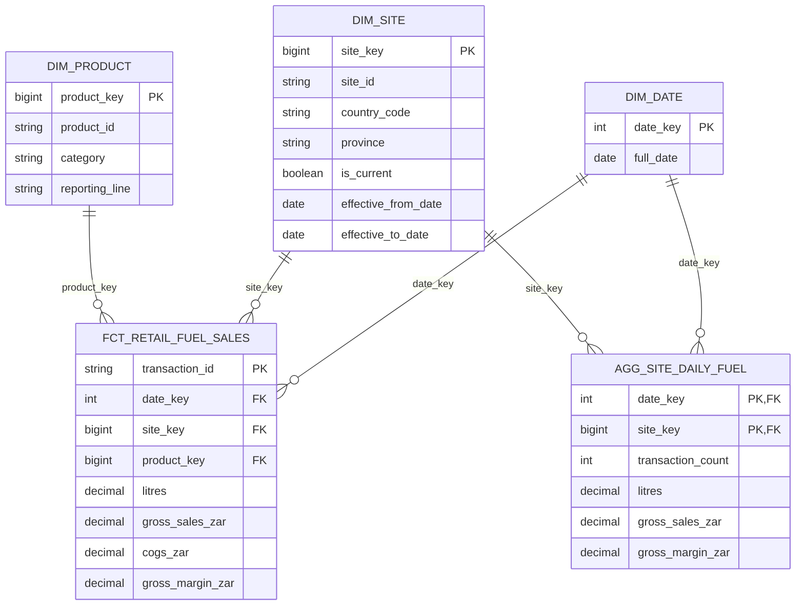

# Gold retail model: logical ERD and validation

This diagram describes the dbt Gold retail path inspected in the repository. It is separate from the generated source-manifest diagrams in this directory and from the Spark-native notebook's key representation. Drakens Energy and its data are synthetic.

## Grain and relationships

| Table | Logical grain | Key or relationship evidence |
|---|---|---|
| `dim_date` | One row per calendar day | `date_key` unique/not-null tests in `_core.yml` |
| `dim_site` | Site dimension record, with version/current attributes | `site_key` unique/not-null tests; retail fact resolves the current row |
| `dim_product` | Product dimension record | `product_key` in the dimension and tested retail FK |
| `fct_retail_fuel_sales` | One retail transaction line | `transaction_id` unique/not-null; date/site/product relationship tests |
| `agg_site_daily_fuel` | One date and resolved site key | Unique combination test for `date_key`, `site_key` |

Types are logical categories for diagram readability, not a substitute for exported physical DDL. `||--o{` denotes one dimension member to zero or many fact rows. PK denotes the logical unique grain; the two aggregate PK fields form a composite key. FK denotes the intended relationship. dbt tests provide executable validation but do not, by themselves, prove a physical database FK constraint is enforced.

The aggregate is derived from the transaction fact. It is not joined to that fact as another dimension: joining two many-row facts without respecting grain can multiply measures. Unmatched site and product references resolve to `-1` in the dbt fact and remain identifiable through unmatched flags. Unknown source site codes are normalized to the member identity at aggregate grain.

## Historical boundary

The dimension carries version/current metadata, but the retail model selects `is_current` before joining by business identifier. Do not claim historical as-of resolution from the presence of SCD2 fields alone. The Spark notebook additionally assigns `site_key` from `site_id`, so its physical key representation must be documented separately.

## Source-backed checks

- [Retail fact SQL](../../dbt/models/marts/retail/fct_retail_fuel_sales.sql)
- [Site-day aggregate SQL](../../dbt/models/marts/retail/agg_site_daily_fuel.sql)
- [Retail grain and relationship tests](../../dbt/models/marts/retail/_retail.yml)
- [Conformed dimension tests](../../dbt/models/marts/core/_core.yml)
- [Site dimension](../../dbt/models/marts/core/dim_site.sql)
- [Spark Gold path](../../databricks/notebooks/03_gold_star_schema.py)

Before publication, attach the actual schema and successful key/grain test output for the selected environment. Expand the same validation method to the other subject areas in [the existing index](README.md); this one diagram does not certify all source-manifest relationships. In the PDF, give the diagram a full-width page and keep the grain table adjacent rather than shrinking the entire estate into one figure.
