# ERD — HSSEQ

> **Independent synthetic portfolio project.** Drakens Energy is a fictional company; no real company's data is used.

Generated from the build manifest by `scripts/generate_erd.py`.

```mermaid
erDiagram
    DIM_DATE ||--o{ FACT_ENVIRONMENTAL_EVENTS : ""
    DIM_SITE ||--o{ FACT_ENVIRONMENTAL_EVENTS : ""
    DIM_TERMINAL ||--o{ FACT_ENVIRONMENTAL_EVENTS : ""
    DIM_DATA_SOURCE ||--o{ FACT_ENVIRONMENTAL_EVENTS : ""
    DIM_DATE ||--o{ FACT_HSSEQ_INCIDENTS : ""
    DIM_SITE ||--o{ FACT_HSSEQ_INCIDENTS : ""
    DIM_DATA_SOURCE ||--o{ FACT_HSSEQ_INCIDENTS : ""
    DIM_DATE ||--o{ FACT_NEAR_MISSES : ""
    DIM_SITE ||--o{ FACT_NEAR_MISSES : ""
    DIM_DATA_SOURCE ||--o{ FACT_NEAR_MISSES : ""
    DIM_DATE ||--o{ FACT_PERMIT_TO_WORK : ""
    DIM_SITE ||--o{ FACT_PERMIT_TO_WORK : ""
    DIM_DATA_SOURCE ||--o{ FACT_PERMIT_TO_WORK : ""
    DIM_DATE ||--o{ FACT_SAFETY_OBSERVATIONS : ""
    DIM_SITE ||--o{ FACT_SAFETY_OBSERVATIONS : ""
    DIM_DATA_SOURCE ||--o{ FACT_SAFETY_OBSERVATIONS : ""
    DIM_DATE ||--o{ FACT_TRAINING_COMPLIANCE : ""
    DIM_EMPLOYEE ||--o{ FACT_TRAINING_COMPLIANCE : ""
    DIM_SITE ||--o{ FACT_TRAINING_COMPLIANCE : ""
    DIM_DATA_SOURCE ||--o{ FACT_TRAINING_COMPLIANCE : ""
    DIM_DATE ||--o{ FACT_VEHICLE_SAFETY_EVENTS : ""
    DIM_VEHICLE ||--o{ FACT_VEHICLE_SAFETY_EVENTS : ""
    DIM_DRIVER ||--o{ FACT_VEHICLE_SAFETY_EVENTS : ""
    DIM_DATA_SOURCE ||--o{ FACT_VEHICLE_SAFETY_EVENTS : ""
    FACT_ENVIRONMENTAL_EVENTS {
        string date_key FK
        string site_id FK
        string terminal_id FK
        string source_system_code FK
        decimal volume_released_litres
        decimal soil_affected_m2
        decimal remediation_cost_zar
        decimal days_to_remediate
    }
    FACT_HSSEQ_INCIDENTS {
        string date_key FK
        string site_id FK
        string source_system_code FK
        decimal lost_days
        decimal estimated_cost_zar
        decimal investigation_days
    }
    FACT_NEAR_MISSES {
        string date_key FK
        string site_id FK
        string source_system_code FK
        decimal days_to_close
    }
    FACT_PERMIT_TO_WORK {
        string date_key FK
        string site_id FK
        string source_system_code FK
        decimal planned_duration_hours
    }
    FACT_SAFETY_OBSERVATIONS {
        string date_key FK
        string site_id FK
        string source_system_code FK
    }
    FACT_TRAINING_COMPLIANCE {
        string date_key FK
        string employee_id FK
        string site_id FK
        string source_system_code FK
    }
    FACT_VEHICLE_SAFETY_EVENTS {
        string date_key FK
        string vehicle_id FK
        string driver_id FK
        string source_system_code FK
        decimal speed_kph
        decimal g_force
        decimal latitude
        decimal longitude
    }
    DIM_DATA_SOURCE {
        string data_source_id PK
    }
    DIM_DATE {
        string date_id PK
    }
    DIM_DRIVER {
        string driver_id PK
    }
    DIM_EMPLOYEE {
        string employee_id PK
    }
    DIM_SITE {
        string site_id PK
    }
    DIM_TERMINAL {
        string terminal_id PK
    }
    DIM_VEHICLE {
        string vehicle_id PK
    }
```

## Tables in this domain

| Fact | Grain | Rows | Dimensions |
|---|---|---:|---:|
| `fact_environmental_events` | one row per environmental events | 22,000 | 4 |
| `fact_hsseq_incidents` | one row per hsseq incidents | 15,000 | 3 |
| `fact_near_misses` | one row per near misses | 46,000 | 3 |
| `fact_permit_to_work` | one row per permit to work | 150,000 | 3 |
| `fact_safety_observations` | one row per safety observations | 180,000 | 3 |
| `fact_training_compliance` | one row per training compliance | 260,000 | 4 |
| `fact_vehicle_safety_events` | one row per vehicle safety events | 90,000 | 4 |

