# ERD — Logistics and fleet

> **Independent synthetic portfolio project.** Drakens Energy is a fictional company; no real company's data is used.

Generated from the build manifest by `scripts/generate_erd.py`.

```mermaid
erDiagram
    DIM_DATE ||--o{ FACT_DELIVERIES : ""
    DIM_ROUTE ||--o{ FACT_DELIVERIES : ""
    DIM_TERMINAL ||--o{ FACT_DELIVERIES : ""
    DIM_SITE ||--o{ FACT_DELIVERIES : ""
    DIM_VEHICLE ||--o{ FACT_DELIVERIES : ""
    DIM_DRIVER ||--o{ FACT_DELIVERIES : ""
    DIM_CARRIER ||--o{ FACT_DELIVERIES : ""
    DIM_PRODUCT ||--o{ FACT_DELIVERIES : ""
    DIM_DATA_SOURCE ||--o{ FACT_DELIVERIES : ""
    DIM_DATE ||--o{ FACT_DELIVERY_EVENTS : ""
    DIM_VEHICLE ||--o{ FACT_DELIVERY_EVENTS : ""
    DIM_DATA_SOURCE ||--o{ FACT_DELIVERY_EVENTS : ""
    DIM_DATE ||--o{ FACT_FLEET_COSTS : ""
    DIM_VEHICLE ||--o{ FACT_FLEET_COSTS : ""
    DIM_CARRIER ||--o{ FACT_FLEET_COSTS : ""
    DIM_COST_CENTRE ||--o{ FACT_FLEET_COSTS : ""
    DIM_DATA_SOURCE ||--o{ FACT_FLEET_COSTS : ""
    DIM_DATE ||--o{ FACT_ROUTE_PERFORMANCE : ""
    DIM_ROUTE ||--o{ FACT_ROUTE_PERFORMANCE : ""
    DIM_DATA_SOURCE ||--o{ FACT_ROUTE_PERFORMANCE : ""
    DIM_DATE ||--o{ FACT_VEHICLE_TRIPS : ""
    DIM_VEHICLE ||--o{ FACT_VEHICLE_TRIPS : ""
    DIM_DRIVER ||--o{ FACT_VEHICLE_TRIPS : ""
    DIM_ROUTE ||--o{ FACT_VEHICLE_TRIPS : ""
    DIM_DATA_SOURCE ||--o{ FACT_VEHICLE_TRIPS : ""
    FACT_DELIVERIES {
        string date_key FK
        string route_id FK
        string origin_terminal_id FK
        string destination_site_id FK
        string vehicle_id FK
        string driver_id FK
        string carrier_id FK
        string product_id FK
        string source_system_code FK
        decimal planned_litres
        decimal delivered_litres
        decimal distance_km
    }
    FACT_DELIVERY_EVENTS {
        string date_key FK
        string vehicle_id FK
        string source_system_code FK
        decimal latitude
        decimal longitude
        decimal speed_kph
        decimal odometer_km
    }
    FACT_FLEET_COSTS {
        string date_key FK
        string vehicle_id FK
        string carrier_id FK
        string cost_centre_code FK
        string source_system_code FK
        decimal amount_zar
        decimal kilometres_in_period
    }
    FACT_ROUTE_PERFORMANCE {
        string date_key FK
        string route_id FK
        string source_system_code FK
        decimal planned_distance_km
        decimal actual_distance_km
        decimal planned_duration_hours
        decimal actual_duration_hours
        decimal cost_per_km_zar
    }
    FACT_VEHICLE_TRIPS {
        string date_key FK
        string vehicle_id FK
        string driver_id FK
        string route_id FK
        string source_system_code FK
        decimal distance_km
        decimal duration_hours
        decimal average_speed_kph
        decimal fuel_consumed_litres
        decimal litres_per_100km
        decimal idle_minutes
    }
    DIM_CARRIER {
        string carrier_id PK
    }
    DIM_COST_CENTRE {
        string cost_centre_id PK
    }
    DIM_DATA_SOURCE {
        string data_source_id PK
    }
    DIM_DATE {
        string date_id PK
    }
    DIM_DRIVER {
        string driver_id PK
    }
    DIM_PRODUCT {
        string product_id PK
    }
    DIM_ROUTE {
        string route_id PK
    }
    DIM_SITE {
        string site_id PK
    }
    DIM_TERMINAL {
        string terminal_id PK
    }
    DIM_VEHICLE {
        string vehicle_id PK
    }
```

## Tables in this domain

| Fact | Grain | Rows | Dimensions |
|---|---|---:|---:|
| `fact_deliveries` | one row per deliveries | 300,000 | 9 |
| `fact_delivery_events` | one row per delivery events | 1,100,000 | 3 |
| `fact_fleet_costs` | one row per fleet costs | 180,000 | 5 |
| `fact_route_performance` | one row per route performance | 150,000 | 3 |
| `fact_vehicle_trips` | one row per vehicle trips | 340,000 | 5 |

