# ERD — LPG, lubricants, aviation and marine

> **Independent synthetic portfolio project.** Drakens Energy is a fictional company; no real company's data is used.

Generated from the build manifest by `scripts/generate_erd.py`.

```mermaid
erDiagram
    DIM_DATE ||--o{ FACT_AIRCRAFT_UPLIFTS : ""
    DIM_AIRPORT ||--o{ FACT_AIRCRAFT_UPLIFTS : ""
    DIM_AIRLINE ||--o{ FACT_AIRCRAFT_UPLIFTS : ""
    DIM_DATA_SOURCE ||--o{ FACT_AIRCRAFT_UPLIFTS : ""
    DIM_DATE ||--o{ FACT_AVIATION_INVENTORY_SNAPSHOT : ""
    DIM_AIRPORT ||--o{ FACT_AVIATION_INVENTORY_SNAPSHOT : ""
    DIM_PRODUCT ||--o{ FACT_AVIATION_INVENTORY_SNAPSHOT : ""
    DIM_DATA_SOURCE ||--o{ FACT_AVIATION_INVENTORY_SNAPSHOT : ""
    DIM_DATE ||--o{ FACT_AVIATION_SALES : ""
    DIM_AIRPORT ||--o{ FACT_AVIATION_SALES : ""
    DIM_AIRLINE ||--o{ FACT_AVIATION_SALES : ""
    DIM_CUSTOMER ||--o{ FACT_AVIATION_SALES : ""
    DIM_PRODUCT ||--o{ FACT_AVIATION_SALES : ""
    DIM_DATA_SOURCE ||--o{ FACT_AVIATION_SALES : ""
    DIM_DATE ||--o{ FACT_BUNKER_DELIVERIES : ""
    DIM_PORT ||--o{ FACT_BUNKER_DELIVERIES : ""
    DIM_VESSEL ||--o{ FACT_BUNKER_DELIVERIES : ""
    DIM_DATA_SOURCE ||--o{ FACT_BUNKER_DELIVERIES : ""
    DIM_DATE ||--o{ FACT_LPG_BULK_DELIVERIES : ""
    DIM_CUSTOMER ||--o{ FACT_LPG_BULK_DELIVERIES : ""
    DIM_DEPOT ||--o{ FACT_LPG_BULK_DELIVERIES : ""
    DIM_VEHICLE ||--o{ FACT_LPG_BULK_DELIVERIES : ""
    DIM_DATA_SOURCE ||--o{ FACT_LPG_BULK_DELIVERIES : ""
    DIM_DATE ||--o{ FACT_LPG_CYLINDER_MOVEMENTS : ""
    DIM_SITE ||--o{ FACT_LPG_CYLINDER_MOVEMENTS : ""
    DIM_DEPOT ||--o{ FACT_LPG_CYLINDER_MOVEMENTS : ""
    DIM_DATA_SOURCE ||--o{ FACT_LPG_CYLINDER_MOVEMENTS : ""
    DIM_DATE ||--o{ FACT_LPG_INVENTORY_SNAPSHOT : ""
    DIM_DEPOT ||--o{ FACT_LPG_INVENTORY_SNAPSHOT : ""
    DIM_SITE ||--o{ FACT_LPG_INVENTORY_SNAPSHOT : ""
    DIM_DATA_SOURCE ||--o{ FACT_LPG_INVENTORY_SNAPSHOT : ""
    DIM_DATE ||--o{ FACT_LPG_SALES : ""
    DIM_SITE ||--o{ FACT_LPG_SALES : ""
    DIM_CUSTOMER ||--o{ FACT_LPG_SALES : ""
    DIM_PRODUCT ||--o{ FACT_LPG_SALES : ""
    DIM_DATA_SOURCE ||--o{ FACT_LPG_SALES : ""
    DIM_DATE ||--o{ FACT_LUBRICANT_INVENTORY_SNAPSHOT : ""
    DIM_WAREHOUSE ||--o{ FACT_LUBRICANT_INVENTORY_SNAPSHOT : ""
    DIM_PRODUCT ||--o{ FACT_LUBRICANT_INVENTORY_SNAPSHOT : ""
    DIM_DATA_SOURCE ||--o{ FACT_LUBRICANT_INVENTORY_SNAPSHOT : ""
    DIM_DATE ||--o{ FACT_LUBRICANT_ORDERS : ""
    DIM_CUSTOMER ||--o{ FACT_LUBRICANT_ORDERS : ""
    DIM_WAREHOUSE ||--o{ FACT_LUBRICANT_ORDERS : ""
    DIM_PRODUCT ||--o{ FACT_LUBRICANT_ORDERS : ""
    DIM_DATA_SOURCE ||--o{ FACT_LUBRICANT_ORDERS : ""
    DIM_DATE ||--o{ FACT_LUBRICANT_SALES : ""
    DIM_SITE ||--o{ FACT_LUBRICANT_SALES : ""
    DIM_CUSTOMER ||--o{ FACT_LUBRICANT_SALES : ""
    DIM_PRODUCT ||--o{ FACT_LUBRICANT_SALES : ""
    DIM_DATA_SOURCE ||--o{ FACT_LUBRICANT_SALES : ""
    DIM_DATE ||--o{ FACT_MARINE_INVENTORY_SNAPSHOT : ""
    DIM_PORT ||--o{ FACT_MARINE_INVENTORY_SNAPSHOT : ""
    DIM_PRODUCT ||--o{ FACT_MARINE_INVENTORY_SNAPSHOT : ""
    DIM_DATA_SOURCE ||--o{ FACT_MARINE_INVENTORY_SNAPSHOT : ""
    DIM_DATE ||--o{ FACT_MARINE_SALES : ""
    DIM_PORT ||--o{ FACT_MARINE_SALES : ""
    DIM_CUSTOMER ||--o{ FACT_MARINE_SALES : ""
    DIM_VESSEL ||--o{ FACT_MARINE_SALES : ""
    DIM_PRODUCT ||--o{ FACT_MARINE_SALES : ""
    DIM_DATA_SOURCE ||--o{ FACT_MARINE_SALES : ""
    FACT_AIRCRAFT_UPLIFTS {
        string date_key FK
        string airport_code FK
        string airline_code FK
        string source_system_code FK
        decimal uplift_litres
        decimal uplift_duration_minutes
        decimal density_kg_per_litre
        decimal meter_start
    }
    FACT_AVIATION_INVENTORY_SNAPSHOT {
        string date_key FK
        string airport_code FK
        string product_id FK
        string source_system_code FK
        decimal capacity_litres
        decimal stock_on_hand_litres
        decimal days_of_cover
        decimal water_ppm
    }
    FACT_AVIATION_SALES {
        string date_key FK
        string airport_code FK
        string airline_code FK
        string customer_id FK
        string product_id FK
        string source_system_code FK
        decimal uplift_litres
        decimal unit_price_zar
        decimal revenue_zar
        decimal cogs_zar
    }
    FACT_BUNKER_DELIVERIES {
        string date_key FK
        string port_code FK
        string vessel_imo FK
        string source_system_code FK
        decimal delivered_litres
        decimal pumping_rate_lpm
        decimal delivery_hours
    }
    FACT_LPG_BULK_DELIVERIES {
        string date_key FK
        string customer_id FK
        string depot_id FK
        string vehicle_id FK
        string source_system_code FK
        decimal delivered_kg
        decimal tank_fill_pct_before
        decimal tank_fill_pct_after
        decimal revenue_zar
    }
    FACT_LPG_CYLINDER_MOVEMENTS {
        string date_key FK
        string site_id FK
        string depot_id FK
        string source_system_code FK
        decimal deposit_value_zar
    }
    FACT_LPG_INVENTORY_SNAPSHOT {
        string date_key FK
        string depot_id FK
        string site_id FK
        string source_system_code FK
        decimal capacity_kg
        decimal stock_on_hand_kg
        decimal days_of_cover
    }
    FACT_LPG_SALES {
        string date_key FK
        string site_id FK
        string customer_id FK
        string product_id FK
        string source_system_code FK
        decimal quantity_kg
        decimal unit_price_zar
        decimal revenue_zar
        decimal cogs_zar
        decimal gross_margin_zar
    }
    FACT_LUBRICANT_INVENTORY_SNAPSHOT {
        string date_key FK
        string warehouse_id FK
        string product_id FK
        string source_system_code FK
        decimal stock_on_hand_litres
        decimal stock_value_zar
        decimal pallet_positions_used
        decimal days_of_cover
    }
    FACT_LUBRICANT_ORDERS {
        string date_key FK
        string customer_id FK
        string warehouse_id FK
        string product_id FK
        string source_system_code FK
        decimal ordered_litres
        decimal fulfilled_litres
        decimal lead_time_days
    }
    FACT_LUBRICANT_SALES {
        string date_key FK
        string site_id FK
        string customer_id FK
        string product_id FK
        string source_system_code FK
        decimal quantity_litres
        decimal unit_price_zar
        decimal revenue_zar
        decimal cogs_zar
        decimal gross_margin_zar
    }
    FACT_MARINE_INVENTORY_SNAPSHOT {
        string date_key FK
        string port_code FK
        string product_id FK
        string source_system_code FK
        decimal capacity_litres
        decimal stock_on_hand_litres
        decimal days_of_cover
        decimal viscosity_cst
    }
    FACT_MARINE_SALES {
        string date_key FK
        string port_code FK
        string customer_id FK
        string vessel_imo FK
        string product_id FK
        string source_system_code FK
        decimal bunker_litres
        decimal unit_price_zar
        decimal revenue_zar
        decimal cogs_zar
    }
    DIM_AIRLINE {
        string airline_id PK
    }
    DIM_AIRPORT {
        string airport_id PK
    }
    DIM_CUSTOMER {
        string customer_id PK
    }
    DIM_DATA_SOURCE {
        string data_source_id PK
    }
    DIM_DATE {
        string date_id PK
    }
    DIM_DEPOT {
        string depot_id PK
    }
    DIM_PORT {
        string port_id PK
    }
    DIM_PRODUCT {
        string product_id PK
    }
    DIM_SITE {
        string site_id PK
    }
    DIM_VEHICLE {
        string vehicle_id PK
    }
    DIM_VESSEL {
        string vessel_id PK
    }
    DIM_WAREHOUSE {
        string warehouse_id PK
    }
```

## Tables in this domain

| Fact | Grain | Rows | Dimensions |
|---|---|---:|---:|
| `fact_aircraft_uplifts` | one row per aircraft uplifts | 130,000 | 4 |
| `fact_aviation_inventory_snapshot` | one row per aviation inventory snapshot | 40,000 | 4 |
| `fact_aviation_sales` | one row per aviation sales | 120,000 | 6 |
| `fact_bunker_deliveries` | one row per bunker deliveries | 60,000 | 4 |
| `fact_lpg_bulk_deliveries` | one row per lpg bulk deliveries | 70,000 | 5 |
| `fact_lpg_cylinder_movements` | one row per lpg cylinder movements | 300,000 | 4 |
| `fact_lpg_inventory_snapshot` | one row per lpg inventory snapshot | 120,000 | 4 |
| `fact_lpg_sales` | one row per lpg sales | 400,000 | 5 |
| `fact_lubricant_inventory_snapshot` | one row per lubricant inventory snapshot | 110,000 | 4 |
| `fact_lubricant_orders` | one row per lubricant orders | 150,000 | 5 |
| `fact_lubricant_sales` | one row per lubricant sales | 350,000 | 5 |
| `fact_marine_inventory_snapshot` | one row per marine inventory snapshot | 30,000 | 4 |
| `fact_marine_sales` | one row per marine sales | 90,000 | 6 |

