# ERD — Retail and forecourt

> **Independent synthetic portfolio project.** No internal Vivo Energy, Engen, Shell or Vitol data.

Generated from the build manifest by `scripts/generate_erd.py`.

```mermaid
erDiagram
    DIM_DATE ||--o{ FACT_FORECOURT_SHIFT : ""
    DIM_SITE ||--o{ FACT_FORECOURT_SHIFT : ""
    DIM_DATA_SOURCE ||--o{ FACT_FORECOURT_SHIFT : ""
    DIM_DATE ||--o{ FACT_PRICE_CHANGES : ""
    DIM_SITE ||--o{ FACT_PRICE_CHANGES : ""
    DIM_PRODUCT ||--o{ FACT_PRICE_CHANGES : ""
    DIM_DATA_SOURCE ||--o{ FACT_PRICE_CHANGES : ""
    DIM_DATE ||--o{ FACT_PROMOTIONS : ""
    DIM_SITE ||--o{ FACT_PROMOTIONS : ""
    DIM_PROMOTION ||--o{ FACT_PROMOTIONS : ""
    DIM_DATA_SOURCE ||--o{ FACT_PROMOTIONS : ""
    DIM_DATE ||--o{ FACT_PUMP_METER_READINGS : ""
    DIM_PUMP ||--o{ FACT_PUMP_METER_READINGS : ""
    DIM_SITE ||--o{ FACT_PUMP_METER_READINGS : ""
    DIM_PRODUCT ||--o{ FACT_PUMP_METER_READINGS : ""
    DIM_DATA_SOURCE ||--o{ FACT_PUMP_METER_READINGS : ""
    DIM_DATE ||--o{ FACT_RETAIL_FUEL_PAYMENTS : ""
    DIM_SITE ||--o{ FACT_RETAIL_FUEL_PAYMENTS : ""
    DIM_DATA_SOURCE ||--o{ FACT_RETAIL_FUEL_PAYMENTS : ""
    DIM_DATE ||--o{ FACT_RETAIL_FUEL_SALES : ""
    DIM_TIME ||--o{ FACT_RETAIL_FUEL_SALES : ""
    DIM_SITE ||--o{ FACT_RETAIL_FUEL_SALES : ""
    DIM_PRODUCT ||--o{ FACT_RETAIL_FUEL_SALES : ""
    DIM_LOYALTY_MEMBER ||--o{ FACT_RETAIL_FUEL_SALES : ""
    DIM_DATA_SOURCE ||--o{ FACT_RETAIL_FUEL_SALES : ""
    DIM_DATE ||--o{ FACT_SHOP_RETURNS : ""
    DIM_SITE ||--o{ FACT_SHOP_RETURNS : ""
    DIM_PRODUCT ||--o{ FACT_SHOP_RETURNS : ""
    DIM_DATA_SOURCE ||--o{ FACT_SHOP_RETURNS : ""
    DIM_DATE ||--o{ FACT_SHOP_SALES : ""
    DIM_TIME ||--o{ FACT_SHOP_SALES : ""
    DIM_SITE ||--o{ FACT_SHOP_SALES : ""
    DIM_PRODUCT ||--o{ FACT_SHOP_SALES : ""
    DIM_DATA_SOURCE ||--o{ FACT_SHOP_SALES : ""
    DIM_DATE ||--o{ FACT_SITE_DAILY_OPERATIONS : ""
    DIM_SITE ||--o{ FACT_SITE_DAILY_OPERATIONS : ""
    DIM_DATA_SOURCE ||--o{ FACT_SITE_DAILY_OPERATIONS : ""
    DIM_DATE ||--o{ FACT_TANK_DIPS : ""
    DIM_TANK ||--o{ FACT_TANK_DIPS : ""
    DIM_SITE ||--o{ FACT_TANK_DIPS : ""
    DIM_PRODUCT ||--o{ FACT_TANK_DIPS : ""
    DIM_DATA_SOURCE ||--o{ FACT_TANK_DIPS : ""
    FACT_FORECOURT_SHIFT {
        string date_key FK
        string site_id FK
        string source_system_code FK
        decimal litres_dispensed
        decimal cash_declared_zar
        decimal cash_variance_zar
        decimal pump_downtime_minutes
    }
    FACT_PRICE_CHANGES {
        string date_key FK
        string site_id FK
        string product_id FK
        string source_system_code FK
        decimal old_price_zar
        decimal new_price_zar
        decimal change_cents_per_litre
    }
    FACT_PROMOTIONS {
        string date_key FK
        string site_id FK
        string promotion_id FK
        string source_system_code FK
        decimal baseline_units
        decimal promoted_units
        decimal discount_cost_zar
        decimal incremental_margin_zar
    }
    FACT_PUMP_METER_READINGS {
        string date_key FK
        string pump_id FK
        string site_id FK
        string product_id FK
        string source_system_code FK
        decimal totaliser_litres
        decimal litres_since_last_reading
    }
    FACT_RETAIL_FUEL_PAYMENTS {
        string date_key FK
        string site_id FK
        string source_system_code FK
        decimal amount_zar
    }
    FACT_RETAIL_FUEL_SALES {
        string date_key FK
        string time_key FK
        string site_id FK
        string product_id FK
        string loyalty_member_id FK
        string source_system_code FK
        decimal litres
        decimal unit_price_zar
        decimal gross_sales_zar
        decimal cogs_zar
        decimal gross_margin_zar
    }
    FACT_SHOP_RETURNS {
        string date_key FK
        string site_id FK
        string product_id FK
        string source_system_code FK
        decimal refund_value_zar
    }
    FACT_SHOP_SALES {
        string date_key FK
        string time_key FK
        string site_id FK
        string product_id FK
        string source_system_code FK
        decimal unit_price_zar
        decimal gross_sales_zar
        decimal cogs_zar
        decimal gross_margin_zar
    }
    FACT_SITE_DAILY_OPERATIONS {
        string date_key FK
        string site_id FK
        string source_system_code FK
        decimal fuel_litres
        decimal fuel_revenue_zar
        decimal shop_revenue_zar
        decimal average_basket_zar
        decimal staff_hours
        decimal energy_kwh
    }
    FACT_TANK_DIPS {
        string date_key FK
        string tank_id FK
        string site_id FK
        string product_id FK
        string source_system_code FK
        decimal volume_litres
        decimal ullage_litres
        decimal water_level_mm
        decimal temperature_celsius
    }
    DIM_DATA_SOURCE {
        string data_source_id PK
    }
    DIM_DATE {
        string date_id PK
    }
    DIM_LOYALTY_MEMBER {
        string loyalty_member_id PK
    }
    DIM_PRODUCT {
        string product_id PK
    }
    DIM_PROMOTION {
        string promotion_id PK
    }
    DIM_PUMP {
        string pump_id PK
    }
    DIM_SITE {
        string site_id PK
    }
    DIM_TANK {
        string tank_id PK
    }
    DIM_TIME {
        string time_id PK
    }
```

## Tables in this domain

| Fact | Grain | Rows | Dimensions |
|---|---|---:|---:|
| `fact_forecourt_shift` | one row per forecourt shift | 420,000 | 3 |
| `fact_price_changes` | one row per price changes | 260,000 | 4 |
| `fact_promotions` | one row per promotions | 40,000 | 4 |
| `fact_pump_meter_readings` | one row per pump meter readings | 800,000 | 5 |
| `fact_retail_fuel_payments` | one row per retail fuel payments | 900,000 | 3 |
| `fact_retail_fuel_sales` | one row per retail fuel sales | 5,000,000 | 6 |
| `fact_shop_returns` | one row per shop returns | 60,000 | 4 |
| `fact_shop_sales` | one row per shop sales | 3,000,000 | 5 |
| `fact_site_daily_operations` | one row per site daily operations | 500,000 | 3 |
| `fact_tank_dips` | one row per tank dips | 700,000 | 5 |

