# ERD — Supply and storage

> **Independent synthetic portfolio project.** No internal Vivo Energy, Engen, Shell or Vitol data.

Generated from the build manifest by `scripts/generate_erd.py`.

```mermaid
erDiagram
    DIM_DATE ||--o{ FACT_IMPORT_CARGOES : ""
    DIM_SUPPLIER ||--o{ FACT_IMPORT_CARGOES : ""
    DIM_PRODUCT ||--o{ FACT_IMPORT_CARGOES : ""
    DIM_VESSEL ||--o{ FACT_IMPORT_CARGOES : ""
    DIM_DATA_SOURCE ||--o{ FACT_IMPORT_CARGOES : ""
    DIM_DATE ||--o{ FACT_INVENTORY_ADJUSTMENTS : ""
    DIM_SITE ||--o{ FACT_INVENTORY_ADJUSTMENTS : ""
    DIM_PRODUCT ||--o{ FACT_INVENTORY_ADJUSTMENTS : ""
    DIM_DATA_SOURCE ||--o{ FACT_INVENTORY_ADJUSTMENTS : ""
    DIM_DATE ||--o{ FACT_INVENTORY_MOVEMENTS : ""
    DIM_SITE ||--o{ FACT_INVENTORY_MOVEMENTS : ""
    DIM_TERMINAL ||--o{ FACT_INVENTORY_MOVEMENTS : ""
    DIM_PRODUCT ||--o{ FACT_INVENTORY_MOVEMENTS : ""
    DIM_DATA_SOURCE ||--o{ FACT_INVENTORY_MOVEMENTS : ""
    DIM_DATE ||--o{ FACT_INVENTORY_SNAPSHOT : ""
    DIM_SITE ||--o{ FACT_INVENTORY_SNAPSHOT : ""
    DIM_TERMINAL ||--o{ FACT_INVENTORY_SNAPSHOT : ""
    DIM_PRODUCT ||--o{ FACT_INVENTORY_SNAPSHOT : ""
    DIM_DATA_SOURCE ||--o{ FACT_INVENTORY_SNAPSHOT : ""
    DIM_DATE ||--o{ FACT_PROCUREMENT_ORDERS : ""
    DIM_SUPPLIER ||--o{ FACT_PROCUREMENT_ORDERS : ""
    DIM_TERMINAL ||--o{ FACT_PROCUREMENT_ORDERS : ""
    DIM_PRODUCT ||--o{ FACT_PROCUREMENT_ORDERS : ""
    DIM_DATA_SOURCE ||--o{ FACT_PROCUREMENT_ORDERS : ""
    DIM_DATE ||--o{ FACT_PROCUREMENT_RECEIPTS : ""
    DIM_SUPPLIER ||--o{ FACT_PROCUREMENT_RECEIPTS : ""
    DIM_TERMINAL ||--o{ FACT_PROCUREMENT_RECEIPTS : ""
    DIM_PRODUCT ||--o{ FACT_PROCUREMENT_RECEIPTS : ""
    DIM_DATA_SOURCE ||--o{ FACT_PROCUREMENT_RECEIPTS : ""
    DIM_DATE ||--o{ FACT_REPLENISHMENT_ORDERS : ""
    DIM_SITE ||--o{ FACT_REPLENISHMENT_ORDERS : ""
    DIM_TERMINAL ||--o{ FACT_REPLENISHMENT_ORDERS : ""
    DIM_PRODUCT ||--o{ FACT_REPLENISHMENT_ORDERS : ""
    DIM_DATA_SOURCE ||--o{ FACT_REPLENISHMENT_ORDERS : ""
    DIM_DATE ||--o{ FACT_STOCK_LOSSES : ""
    DIM_SITE ||--o{ FACT_STOCK_LOSSES : ""
    DIM_TERMINAL ||--o{ FACT_STOCK_LOSSES : ""
    DIM_PRODUCT ||--o{ FACT_STOCK_LOSSES : ""
    DIM_DATA_SOURCE ||--o{ FACT_STOCK_LOSSES : ""
    DIM_DATE ||--o{ FACT_TERMINAL_ISSUES : ""
    DIM_TERMINAL ||--o{ FACT_TERMINAL_ISSUES : ""
    DIM_PRODUCT ||--o{ FACT_TERMINAL_ISSUES : ""
    DIM_VEHICLE ||--o{ FACT_TERMINAL_ISSUES : ""
    DIM_SITE ||--o{ FACT_TERMINAL_ISSUES : ""
    DIM_DATA_SOURCE ||--o{ FACT_TERMINAL_ISSUES : ""
    DIM_DATE ||--o{ FACT_TERMINAL_RECEIPTS : ""
    DIM_TERMINAL ||--o{ FACT_TERMINAL_RECEIPTS : ""
    DIM_PRODUCT ||--o{ FACT_TERMINAL_RECEIPTS : ""
    DIM_SUPPLIER ||--o{ FACT_TERMINAL_RECEIPTS : ""
    DIM_DATA_SOURCE ||--o{ FACT_TERMINAL_RECEIPTS : ""
    DIM_DATE ||--o{ FACT_TERMINAL_THROUGHPUT : ""
    DIM_TERMINAL ||--o{ FACT_TERMINAL_THROUGHPUT : ""
    DIM_PRODUCT ||--o{ FACT_TERMINAL_THROUGHPUT : ""
    DIM_DATA_SOURCE ||--o{ FACT_TERMINAL_THROUGHPUT : ""
    FACT_IMPORT_CARGOES {
        string date_key FK
        string supplier_id FK
        string product_id FK
        string vessel_imo FK
        string source_system_code FK
        decimal cargo_volume_litres
        decimal discharge_hours
        decimal demurrage_hours
        decimal demurrage_cost_usd
        decimal landed_cost_zar_per_litre
    }
    FACT_INVENTORY_ADJUSTMENTS {
        string date_key FK
        string site_id FK
        string product_id FK
        string source_system_code FK
        decimal book_stock_litres
        decimal physical_stock_litres
        decimal variance_litres
    }
    FACT_INVENTORY_MOVEMENTS {
        string date_key FK
        string site_id FK
        string terminal_id FK
        string product_id FK
        string source_system_code FK
        decimal quantity_litres
        decimal signed_quantity_litres
    }
    FACT_INVENTORY_SNAPSHOT {
        string date_key FK
        string site_id FK
        string terminal_id FK
        string product_id FK
        string source_system_code FK
        decimal capacity_litres
        decimal stock_on_hand_litres
        decimal ullage_litres
        decimal average_daily_usage_litres
        decimal days_of_cover
        decimal reorder_point_litres
    }
    FACT_PROCUREMENT_ORDERS {
        string date_key FK
        string supplier_id FK
        string terminal_id FK
        string product_id FK
        string source_system_code FK
        decimal ordered_litres
        decimal contracted_price_zar
    }
    FACT_PROCUREMENT_RECEIPTS {
        string date_key FK
        string supplier_id FK
        string terminal_id FK
        string product_id FK
        string source_system_code FK
        decimal quantity_litres
        decimal unit_cost_zar
        decimal total_cost_zar
        decimal density_kg_per_m3
        decimal temperature_celsius
    }
    FACT_REPLENISHMENT_ORDERS {
        string date_key FK
        string site_id FK
        string terminal_id FK
        string product_id FK
        string source_system_code FK
        decimal requested_litres
        decimal days_of_cover_at_raise
    }
    FACT_STOCK_LOSSES {
        string date_key FK
        string site_id FK
        string terminal_id FK
        string product_id FK
        string source_system_code FK
        decimal loss_litres
        decimal loss_value_zar
    }
    FACT_TERMINAL_ISSUES {
        string date_key FK
        string terminal_id FK
        string product_id FK
        string vehicle_id FK
        string destination_site_id FK
        string source_system_code FK
        decimal issued_litres
        decimal loading_minutes
        decimal queue_minutes
    }
    FACT_TERMINAL_RECEIPTS {
        string date_key FK
        string terminal_id FK
        string product_id FK
        string supplier_id FK
        string source_system_code FK
        decimal gross_litres
        decimal net_litres_at_20c
        decimal loss_litres
    }
    FACT_TERMINAL_THROUGHPUT {
        string date_key FK
        string terminal_id FK
        string product_id FK
        string source_system_code FK
        decimal opening_stock_litres
        decimal receipts_litres
        decimal issues_litres
        decimal closing_stock_litres
        decimal days_of_cover
        decimal gain_loss_litres
    }
    DIM_DATA_SOURCE {
        string data_source_id PK
    }
    DIM_DATE {
        string date_id PK
    }
    DIM_PRODUCT {
        string product_id PK
    }
    DIM_SITE {
        string site_id PK
    }
    DIM_SUPPLIER {
        string supplier_id PK
    }
    DIM_TERMINAL {
        string terminal_id PK
    }
    DIM_VEHICLE {
        string vehicle_id PK
    }
    DIM_VESSEL {
        string vessel_id PK
    }
```

## Tables in this domain

| Fact | Grain | Rows | Dimensions |
|---|---|---:|---:|
| `fact_import_cargoes` | one row per import cargoes | 9,000 | 5 |
| `fact_inventory_adjustments` | one row per inventory adjustments | 120,000 | 4 |
| `fact_inventory_movements` | one row per inventory movements | 900,000 | 5 |
| `fact_inventory_snapshot` | one row per inventory snapshot | 1,200,000 | 5 |
| `fact_procurement_orders` | one row per procurement orders | 190,000 | 5 |
| `fact_procurement_receipts` | one row per procurement receipts | 250,000 | 5 |
| `fact_replenishment_orders` | one row per replenishment orders | 260,000 | 5 |
| `fact_stock_losses` | one row per stock losses | 60,000 | 5 |
| `fact_terminal_issues` | one row per terminal issues | 210,000 | 6 |
| `fact_terminal_receipts` | one row per terminal receipts | 140,000 | 5 |
| `fact_terminal_throughput` | one row per terminal throughput | 180,000 | 4 |

