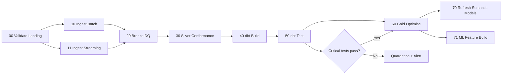

# Orchestration plan

## Suggested jobs
- Intraday POS / digital: streaming or 5–15 minute micro-batch.
- Tank / EV / solar telemetry: Event Hubs + Structured Streaming.
- Commercial / ERP: hourly or daily CDC.
- Supplier files: event-triggered Auto Loader.
- dbt marts: hourly for operational marts; daily for finance/executive snapshots.
- Power BI: Direct Lake where appropriate, otherwise scheduled refresh after Gold success.
