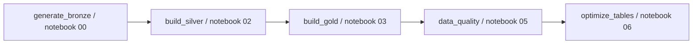

# Databricks implementation walkthrough

Drakens Energy is a fictional business. This portfolio uses generated data, including jittered town-centroid coordinates; it does not represent real service stations or company records.

This walkthrough explains the implementation present in the repository, the decisions it demonstrates, and the evidence needed to validate a run. Source review is not a cloud execution result. Local DuckDB results, Spark notebook results and Power BI captures must retain their own environment, profile, date and commit context.

## 1. Business questions and data design

The platform connects fuel transactions, sites, products, customers and operational events so a reviewer can follow margin, service reliability, replenishment and investment decisions back to source records. Conformed dimensions allow the same site to be analysed across subjects without separately maintained definitions.

Start with the [implementation guide](IMPLEMENTATION_GUIDE.md), [data dictionary](data_dictionary.md), [subject-area ERDs](erd/README.md), and the [Gold retail ERD](erd/erd_gold_retail_validated.md). State the grain before describing a metric: a transaction line, a site-day aggregate and a site scorecard are different populations.

**Evidence to show:** an architecture diagram, source inventory, a small source sample, and a model diagram with keys and fact grain. Explain the choice of transactional detail plus aggregates as a trade-off between traceability and report query cost.

## 2. Select the execution path and scale

The repository contains several paths; they are not interchangeable run records.

| Path | Entry point | What the source implements | Evidence required for an execution claim |
|---|---|---|---|
| Local reference build | `src/drakens360/build.py`, dbt models | Python-generated landing data and a local warehouse used by CI | Selected manifest, warehouse path, command output, commit and test results |
| Spark-native batch job | `scripts/deploy_databricks.py`, notebooks 00/02/03/05/06 | In-workspace generation followed by conformance, marts, quality and maintenance | Workspace job/run ID, task outcomes and actual output counts |
| File ingestion | Notebook 01 | Auto Loader configuration for landed feeds | Source file, checkpoint/schema location and completed ingestion evidence |
| Streaming example | Notebook 04 | Demo rate source and a separate Kafka source branch | Mode, actual source schema, query progress and restart/late-event evidence |

The notebook 00 `SCALES` dictionary currently configures portfolio generation with 1,050 ZA sites and 4,200 total sites. The previously inspected local report warehouse contains 250 ZA sites and 587 total sites. These are different implementations and profiles. Do not replace one with the other's total or say that all code generates the same estate. Measure the particular artifact used by each figure.

## 3. Workspace and catalog preparation

[`scripts/deploy_databricks.py`](../scripts/deploy_databricks.py) selects a configured authentication profile, uses an existing SQL warehouse, creates an environment catalog and schemas, uploads notebooks, and creates or resets the named job. `--run` triggers execution; deployment alone does not demonstrate a successful run. The code selects the first returned SQL warehouse, so a reproducibility record must identify which warehouse was actually used.

[`01_catalog_and_schemas.sql`](../databricks/sql/01_catalog_and_schemas.sql) also defines managed volumes, including landing and checkpoints. Notebook upload, schema creation and volume preparation are separate concerns: the deployment helper's catalog function creates schemas, not every volume referenced by optional ingestion notebooks. Inspect required locations before attempting that path.

Record the environment, runtime/compute, dependency versions, catalog, notebook revision and selected scale. Use configuration names in screenshots; exclude secret values. Terraform and Bicep files under `infra/` describe an Azure infrastructure option, and should be labelled as provisioned only when deployment evidence exists.

**Skill demonstrated:** reproducible environment configuration, separation of environments, explicit dependencies and avoidance of credentials in source.

## 4. Generate and inspect Bronze data

[`00_generate_bronze_at_scale.py`](../databricks/notebooks/00_generate_bronze_at_scale.py) uses Spark expressions and scale/seed widgets to create synthetic records in the chosen catalog. The local generator is a separate reference path. Inspect the manifest for the selected local build rather than assuming a notebook run produced that manifest.

Show a small, named input sample with examples of injected defects: numeric text, whitespace, sentinels, duplicate business keys or broken references. Explain which layer will handle each defect. Raw row counts and defect counts describe different things because one record can contain several defects.

**Capture:** parameters, completed generation output, table preview and the corresponding manifest where applicable. A generated analytical plot is useful here but does not replace execution evidence.

## 5. Explain the optional Auto Loader path

[`01_bronze_autoloader.py`](../databricks/notebooks/01_bronze_autoloader.py) has a feed registry for forecourt, shop, commercial, finance and maintenance inputs. It constructs per-feed checkpoint and schema paths and configures `cloudFiles` options including `addNewColumns`, a rescued-data column and a micro-batch file limit.

Document the exact feed, input format, source path, schema location, checkpoint and trigger mode used. Show that a second ingestion of the same input does not unexpectedly increase the target and explain what happens when an upstream schema changes. Configuration alone does not prove restart behavior or uninterrupted schema evolution.

The default generated batch job does not include notebook 01. Keep it visibly separate in the workflow diagram, and do not imply it executed because the five-task batch job succeeded.

## 6. Silver conformance and quarantine

[`02_silver_conformance.py`](../databricks/notebooks/02_silver_conformance.py) declares contracts per feed. For retail fuel, examples include required transaction/site/product identifiers, plausible litres and unit prices, and gross-margin reconciliation. It records rule outcomes, writes rejected records to `platform.quarantine`, ranks records for deduplication using business keys and timestamps, and writes Silver output.

Use the same business key in the before/after example. Show raw values, the applied rule, accepted output or rejection reason, and the associated run. Reconcile the input population with accepted records, quarantined records and duplicate removal using the implementation's actual counting order; do not add overlapping categories as though they were mutually exclusive.

The notebook includes a dimension SCD2 merge implementation. Demonstrate history with a controlled changed attribute and the resulting current/expired records before claiming the behavior is verified. Distinguish storing dimension history from resolving a fact to the correct historical version.

**Skill demonstrated:** explicit data contracts, traceable cleaning, deterministic deduplication and explainable rejection handling.

## 7. Gold marts, keys and grain

[`03_gold_star_schema.py`](../databricks/notebooks/03_gold_star_schema.py) builds Spark-native dimensions and marts. The dbt models provide a separate path under `dbt/models/marts/`. Both should be explained with their real definitions rather than described as identical merely because table names resemble each other.

The dbt retail fact is one transaction line per `transaction_id`. It resolves the current site/product dimension by business identifier and maps unmatched keys to the unknown member `-1`, retaining flags that make drift countable. The site-day aggregate groups by `date_key` and `site_key`. Revenue, cost, litres and margin can be summed over compatible populations; a margin percentage should be recomputed from its numerator and denominator.

Important historical limitation: the inspected dbt retail join filters dimensions to `is_current`; notebook 03 also selects current site records and assigns `site_key` from `site_id`. Neither detail should be described as proof of an as-of historical fact-to-dimension join. An event-time interval join and controlled historical test would be required to demonstrate that claim.

See the [validated Gold retail model](erd/erd_gold_retail_validated.md) for logical relationships and the distinction from source-manifest diagrams.

## 8. Orchestration and failure boundaries

The actual sequence declared by `create_job()` is:

The helper sets one concurrent run and a task timeout. The listed dependencies explain execution order; do not add a schedule, automatic retry policy, Auto Loader or streaming task to this diagram unless the job definition is changed and verified.

**Capture:** the actual job graph with run ID and final task states. Include a failed task, its diagnosis and rerun evidence where available. Distinguish a repaired local test from a successful remote workflow.

## 9. Streaming telemetry and its current boundary

[`04_streaming_telemetry.py`](../databricks/notebooks/04_streaming_telemetry.py) provides tank, fleet, EV and solar examples. Its demo source yields rate-stream `value` and `timestamp` columns. The production branch returns `raw_json` and `kafka_ts`, while the inspected downstream tank transformation still refers to `value` and `timestamp`. A payload decode/schema adapter is therefore a prerequisite to claiming this production branch works end to end.

Explain event time, configured watermarks, checkpoint paths and the intended destination using the actual code. Show query progress and a late-event/restart test only when executed. A demo generator is not evidence of sustained Event Hubs ingestion. Preserve this boundary in the ebook even when the architecture includes Event Hubs as a planned source.

## 10. Quality, freshness and governance

[`05_data_quality_checks.py`](../databricks/notebooks/05_data_quality_checks.py) produces operational results, including freshness records with a run ID and evaluation time. It distinguishes old backfill data from recent-feed SLA checks and can fail a critical check according to its widget setting. The inspected `MONITORED` list contains SLA constants; do not describe them as dynamically loaded reference data without a code change.

[`02_governance.sql`](../databricks/sql/02_governance.sql) contains group grants, masks and row-filter logic. The SQL file is implementation evidence; proof of effective permissions requires queries under representative identities. Show a permitted result and a restricted result without displaying credentials or unrelated personal data.

**Capture:** quality output, reconciliation differences, quarantine reasons and effective-access evidence. A green control must remain tied to the run, table and population it checked.

## 11. Performance and maintenance

[`06_optimize_and_vacuum.py`](../databricks/notebooks/06_optimize_and_vacuum.py) describes a per-table maintenance plan and captures table statistics. It exposes `run_vacuum` and a retention setting, rejects retention below its 168-hour floor, and follows quality checks in the batch graph.

Present observed file count, table size, runtime and query behavior only with the relevant before/after capture and workload context. Comments reporting an earlier measurement are historical claims until their supporting artifact is identified. A change in file count alone is not a benchmark of query speed or a monetary saving.

Document the effect of retention and maintenance on recoverability. Do not execute maintenance or provision compute merely to fill a screenshot slot.

## 12. ML, decision support and report consumption

The experiments in `ml/experiments/` and the MLflow export in [`export_ml_results.py`](../scripts/export_ml_results.py) provide model evaluation evidence. Explain target, grain, train/test split, leakage controls, metric direction and baseline for each model. AUC is higher-is-better; MAE is lower-is-better. The export's raw score-minus-baseline delta has opposite improvement directions for these metrics and should not be ranked on one mixed-unit chart.

The unsupervised anomaly experiment has a different evaluation status from the scored supervised models. Preserve weak results and missing scores. The network investment engine is a constrained optimization component; do not present its rules or allocation as a learned prediction model.

Show how exported evaluation results reach the Power BI model. Evaluation summary rows are not per-site prediction records. For actual prediction use, identify the scored entity/date grain, model/run identity and consuming visual. Power BI page captures must prove the rendered output, and paired captures should show changed metrics when a South Africa filter changes.

## 13. Reproducibility and portfolio evidence

The implementation guide owns commands and environment setup. [`reconcile_figures.py`](../scripts/reconcile_figures.py) checks document figures against source artifacts; a fresh successful result belongs beside the final generated PDF/HTML versions. Keep the workflow's Git commit and CI result separate from a Databricks run ID.

Use this coverage register when preparing final document figures:

| Evidence | Suitable capture | What it proves |
|---|---|---|
| Environment and scale | Configuration plus run header | Which implementation and population were used |
| Source and Bronze | Actual sample and generation/ingestion result | Input content and completed landing step |
| Silver | Same-key before/after and quarantine result | Transformation or rejection of identifiable records |
| Gold and ERD | Schema, key tests and grain checks | Model structure and relationship validity |
| Job execution | Completed job task graph | Which tasks ran and their outcomes |
| Streaming | Query progress and controlled late/restart examples | The specific streaming behavior exercised |
| Quality and governance | Control results and representative access queries | Validation and effective restrictions for that run |
| ML | Experiment metrics, split details and baseline | Evaluation rather than unsupported accuracy claims |
| Power BI and Excel | Actual pages, filters and formatted results | Correct and readable consumption |
| Final build | Reconciliation and completed CI result | Traceability of the delivered version |

Authentic UI captures remain outstanding where desktop/workspace access is unavailable. Clearly label captured command output as execution output, analytical charts as charts, and missing UI captures as missing. Number figures in document order and keep captions with images. This walkthrough is source-verified documentation; it does not certify those outstanding runtime checks.
